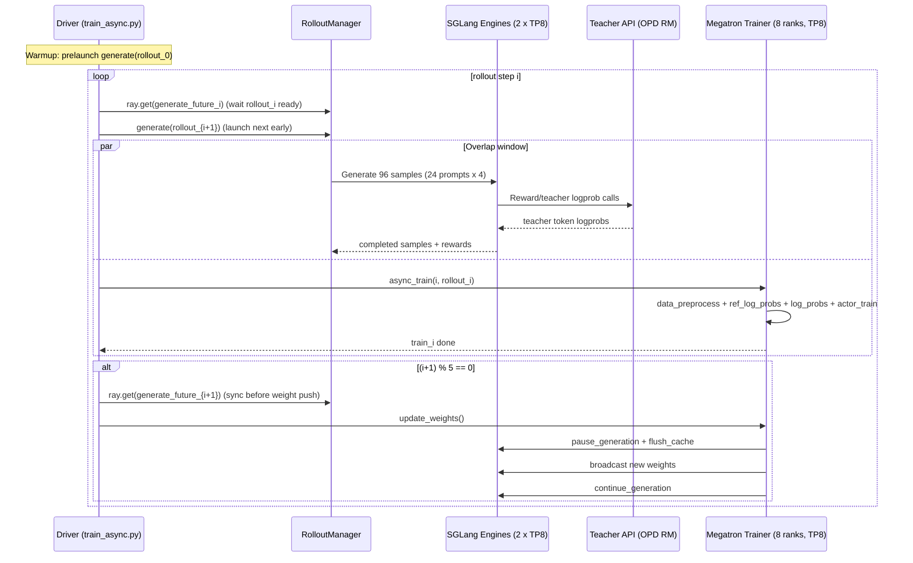

# Async OPD Training Step Walkthrough (Current Setup)

This report explains how one training step works in your **current running async setup** and how rollout/training overlap in practice.

## 1) Active Run + Setup Snapshot

Source of truth:
- Ray job: `raysubmit_gwiLh62ySsp4hJZ3`
- W&B run: `https://wandb.ai/anhvth/slime-opd/runs/nh9ii2tk`
- Driver command from Ray logs confirms these key args:
  - `--actor-num-nodes 1`
  - `--actor-num-gpus-per-node 8`
  - `--rollout-num-gpus 16`
  - `--rollout-num-gpus-per-engine 8`
  - `--tensor-model-parallel-size 8`
  - `--rollout-batch-size 24`
  - `--n-samples-per-prompt 4`
  - `--global-batch-size 96`
  - `--num-steps-per-rollout 1`
  - `--rollout-max-response-len 4096`
  - `--update-weights-interval 5`

Range note:
- Your launcher supports overriding to `2048` via env (`ROLLOUT_MAX_RESPONSE_LEN=2048`), but this active run is currently at `4096`.

Interpretation:
- Training world size = `1 * 8 = 8` ranks.
- TP = 8, so DP = `8 / 8 = 1`.
- You have **1 trainable model replica** (sharded across 8 GPUs).
- Rollout GPUs = 16 with 8 GPUs/engine -> **2 rollout engines**.
- Per rollout, samples produced = `24 * 4 = 96`.
- Because `global_batch_size = 96` and `num_steps_per_rollout = 1`, each rollout feeds exactly one training step.

## 2) What Is One "Training Step" Here?

At high level in async mode:
1. Wait for already-launched rollout `i` to finish.
2. Immediately launch rollout `i+1` (future).
3. Train on rollout `i` while rollout `i+1` is generating.
4. Every 5 steps, synchronize and push weights to rollout engines.

Code anchors:
- Async loop and future pipeline: `train_async.py:31-40`
- Blocking wait for current rollout: `train_async.py:35`
- Launch next rollout early: `train_async.py:39`
- Train on current rollout: `train_async.py:47`
- Periodic weight update barrier: `train_async.py:62-67`

## 3) Per-Step Pipeline (Mermaid)

## 4) Timeline View (Steady Step vs Update Step)

```mermaid
gantt
    title Async Step Timing (Observed Pattern)
    dateFormat X
    axisFormat %s

    section Steady Step (non-update)
    Wait current rollout ready            :done, 0, 1
    Launch next rollout                   :milestone, 1, 0
    Train current rollout                 :active, 1, 57
    Next rollout generation (overlapped) :active, 1, 52

    section Every 5th Step
    Sync next rollout before update       :crit, 58, 2
    update_weights() push to engines      :crit, 60, 2
```

The key point: step wall time is near `max(train_time, rollout_time)`, not their sum, because of overlap.

## 5) What Happens Inside Rollout

Rollout itself is highly concurrent:
- For each prompt group (size 4), a task is created.
- Multiple groups are pending concurrently.
- Completion is consumed with `FIRST_COMPLETED` scheduling.

Code anchors:
- Task submission loop: `slime/rollout/sglang_rollout.py:416-420`
- Wait for first finished tasks: `slime/rollout/sglang_rollout.py:422`
- Stop condition at `rollout_batch_size=24` groups: `slime/rollout/sglang_rollout.py:409`, `slime/rollout/sglang_rollout.py:458`

Teacher scoring path (OPD, sglang mode):
- Reward function calls teacher API using `input_ids`, `max_new_tokens=0`, `return_logprob=True`.
- Then teacher token logprobs are sliced to response span and attached to samples.

Code anchors:
- Reward HTTP call: `examples/on_policy_distillation/on_policy_distillation.py:7-23`
- Extract teacher logprobs: `examples/on_policy_distillation/on_policy_distillation.py:43-53`

## 6) What Happens in `update_weights_interval=5`

When update triggers, trainer uses distributed weight push (non-colocate path):
- pause generation on rollout engines
- flush cache
- transfer non-expert + expert weights
- resume generation

Code anchors:
- Chooses distributed updater in async/non-colocate: `slime/backends/megatron_utils/actor.py:131`
- Update routine: `slime/backends/megatron_utils/update_weight/update_weight_from_distributed.py:74-132`

Practical meaning of stale=5:
- Rollout steps `k..k+4` can be generated with the same policy snapshot.
- Step `k+5` applies a newer snapshot to rollout engines.
- Tradeoff: better throughput, slightly more policy staleness.

## 7) Evidence From Your Live Run (`nh9ii2tk`)

From `ray job logs` snapshot:
- Rollout perf examples:
  - `perf 12`: `rollout_time=53.28s`, `tokens_per_gpu_per_sec=443.59`
  - `perf 14`: `rollout_time=52.01s`, `tokens_per_gpu_per_sec=449.01`
- Train perf examples (steady):
  - `perf 11`: `train_time=59.29s`, `train_wait_time=1.15s`, `wait_time_ratio=0.019`
  - `perf 13`: `train_time=61.58s`, `train_wait_time=1.06s`, `wait_time_ratio=0.017`
- Update steps (every 5):
  - `perf 5`: `update_weights_time=1.27s`, `train_wait_time=2.71s`, `wait_time_ratio=0.046`
  - `perf 10`: `update_weights_time=1.59s`, `train_wait_time=2.93s`, `wait_time_ratio=0.049`
- Warmup/fill effect:
  - early `perf 0` had much larger wait (`train_wait_time=54.73s`) before pipeline reached steady overlap.

This pattern is exactly what we expect from async pipelining with periodic weight-sync barriers.

## 8) Educational Summary

In your current setup, a "step" is not just backward pass.
It is a coordinated cycle of:
- one rollout batch (96 samples),
- teacher logprob enrichment (OPD),
- one train step on 8-GPU TP shard,
- optional weight push every 5 steps.

Why it performs better than sync:
- In sync, train would wait full rollout each iteration.
- Here, rollout `i+1` runs while training `i`, so steady `wait_time_ratio` drops to around ~1-2%.
- The main non-overlapped costs left are periodic update sync points and startup warmup.
